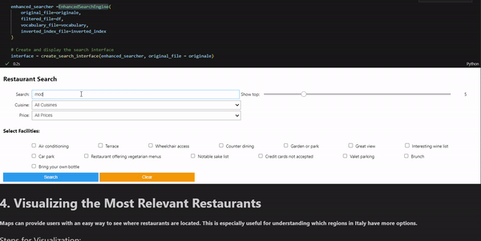

# ADM-HW3
Third homework for the course "Algorithms for Data Mining", deadline 17th November 23:59

This homework was made by the collective effort of: 
Can Lin, 1994375  
Nefeli Apostolou, 2168240  
Gabriel Pinos,  1965035  
name, matricola  <- change it  

# Michelin Restaurant Search Engine for Italy 🍽️

This project aims to build a search engine for Michelin-starred restaurants across Italy, allowing users to explore restaurants that match their culinary preferences.

## Table of Contents
- [Project Overview](#project-overview)
- [Data Collection](#data-collection)
  - [1.1 Get the List of Michelin Restaurants](#11-get-the-list-of-michelin-restaurants)
  - [1.2 Crawl Michelin Restaurant Pages](#12-crawl-michelin-restaurant-pages)
  - [1.3 Parse Downloaded Pages](#13-parse-downloaded-pages)
- [Search Engine Implementation](#search-engine-implementation)
  - [2.1 Conjunctive Query Search Engine](#21-conjunctive-query-search-engine)
  - [2.2 Ranked Search Engine with TF-IDF and Cosine Similarity](#22-ranked-search-engine-with-tf-idf-and-cosine-similarity)
- [Custom Ranking Metric](#custom-ranking-metric)
- [Visualization of Results](#visualization-of-results)
- [Bonus: Advanced Search Engine Features](#bonus-advanced-search-engine-features)
- [Algorithmic Question](#algorithmic-question)

---

## Project Overview

This project aims to create a search engine for Michelin-starred restaurants in Italy. Users can explore and rank restaurants based on specific preferences using features such as cuisine type, facilities, and custom scoring. The search engine includes:
1. **Conjunctive Search Engine**: Finds restaurants matching all query terms in their descriptions.
2. **Ranked Search Engine**: Uses TF-IDF and cosine similarity to return the top-*k* relevant restaurants for each query.

## Data Collection

### 1.1 Get the List of Michelin Restaurants

Our search engine is built on a collection of Michelin-starred restaurants in Italy. The list of restaurant URLs was compiled by scraping the [Michelin Guide](https://guide.michelin.com/en/it/restaurants) website. This list was saved as a `.txt` file with each line containing a single restaurant URL.

### 1.2 Crawl Michelin Restaurant Pages

After collecting the URLs, each restaurant page was downloaded in HTML format. The files were organized into folders according to their page numbers on the Michelin Guide website.

### 1.3 Parse Downloaded Pages

Next, the HTML files were parsed to extract restaurant information, saved in a `.tsv` format. The fields collected for each restaurant include:

- **Restaurant Name**
- **Address**
- **City**
- **Postal Code**
- **Country**
- **Region**
- **Price Range**
- **Cuisine Type**
- **Description**
- **Facilities and Services**
- **Accepted Credit Cards**
- **Phone Number**
- **URL to the Restaurant Page**
- **Latitude**
- **Longitude**

---

## Search Engine Implementation

### 2.1 Conjunctive Query Search Engine

The Conjunctive Search Engine focuses on the **description** field of each restaurant and returns results where all terms in a query are present.

#### Indexing Steps
1. **Vocabulary File**: Created a `vocabulary.csv` file that maps each unique word in the descriptions to a unique integer (`term_id`).
2. **Inverted Index**: Built an inverted index that maps each `term_id` to a list of restaurant document IDs.

#### Query Execution
Given a query such as `"modern seasonal cuisine"`, the search engine retrieves restaurants whose descriptions contain all query terms. The output includes:
- `restaurantName`
- `address`
- `description`
- `website`

### 2.2 Ranked Search Engine with TF-IDF and Cosine Similarity

For more flexible search, a ranked search engine was developed using TF-IDF and cosine similarity to sort results based on relevance.

#### Ranking Steps
1. **TF-IDF Calculation**: Calculated TF-IDF scores for each term in each restaurant’s description.
2. **Inverted Index with TF-IDF Scores**: Created an updated index where each entry contains document IDs and their corresponding TF-IDF scores.
3. **Cosine Similarity**: Used cosine similarity to rank restaurants by relevance.

The output includes top-*k* restaurants with fields:
- `restaurantName`
- `address`
- `description`
- `website`
- Similarity score` (0 to 1)

---

## Custom Ranking Metric

To enhance the search results, we developed a custom scoring metric that takes multiple restaurant attributes into account. The custom score includes:

1. **Description Match**: Weighted based on similarity to the query (using TF-IDF).
2. **Cuisine Match**: Adds weight for matching cuisine types.
3. **Facilities and Services**: Increases the score for matching services (e.g., “Terrace,” “Air conditioning”).
4. **Price Range**: Higher scores for user-preferred price ranges.

The top-*k* restaurants were retrieved based on the custom score, providing a refined list that better matches user preferences.

To further enhance the search and display of restaurants, an interactive user interface in HTML format was developed using the `ipywidgets` package. This interface allows users to explore Michelin restaurants through a personalized and intuitive search experience. The main features of the interface include:

- **Cuisine Type Dropdown Menu**: Enables selection of one or more cuisine types from the available options, helping users find restaurants with specific culinary offerings.
- **Price Range Dropdown Menu**: Allows filtering based on the preferred price range, from `€` to `€€€€`.
- **Facilities and Services Selector**: Offers the ability to select one or more facilities (e.g., Wi-Fi, air conditioning, terrace), customizing the search to find restaurants that meet specific preferences.
- **Results Display Slider**: A control to adjust the number of results displayed, making the view more manageable and adaptable to the user's needs.

This interface simplifies interaction with the custom ranking system, allowing users to refine preferences and obtain targeted results based on cuisine type, price range, facilities, and other criteria.

---

## Visualization of Results

For user-friendly navigation, the project includes an interactive map visualizing restaurant locations in Italy, created using `plotly` . 

To provide an intuitive, interactive geographical representation of Michelin restaurants, a map was implemented using `plotly` and `mapbox`. This map allows users to view restaurant locations across Italy, with visual coding for price range. The main visualization features include:

- **Interactive Geographic Distribution**: Restaurants are displayed on the map according to their geographic location, giving users a clear sense of where they are situated within Italy.
- **Price Range Coding**: Different price ranges are represented through marker color or size, making it easier to visually compare more affordable options with more exclusive ones.
- **Navigation and Zoom**: The interactive map allows users to explore specific areas of Italy, offering a detailed view of Michelin restaurants in each region or city.

[Map Visualizer](images/Map_Visualizer.gif)

---

## Bonus: Advanced Search Engine Features

The project includes optional advanced search capabilities allowing users to filter results by:
1. **Search Criteria**: Query by `restaurantName`, `city`, or `cuisineType`.
2. **Price Range Filter**: Filter by price range (e.g., `€` to `€€€€`).
3. **Region Filter**: Limit results to specific regions in Italy.
4. **Credit Card Preferences**: Filter by accepted credit card types (e.g., Visa, Mastercard).
5. **Facilities and Services**: Specify desired facilities like Wi-Fi or Terrace.

These advanced filters refine searches based on user criteria, creating a more tailored experience.

---

## Algorithmic Question

### Problem Statement
A robot in a grid-based warehouse needs to collect packages located at given coordinates by moving right or up. The objective is to collect all packages in the fewest moves while following a lexicographically smallest path if multiple shortest paths exist.

### Solution Outline
1. **Sort Packages by Coordinates**: Sort package coordinates lexicographically by `(x, y)`.
2. **Path Calculation**: Create a path moving right or up, ensuring that it follows the shortest and lexicographically smallest route.
3. **Validation**: Confirm that each move is possible based on the sorted coordinates; otherwise, return "NO".

---

**Note**: Detailed explanations and comments are provided throughout the code for each decision and step, ensuring the methodology is clear and reproducible.
